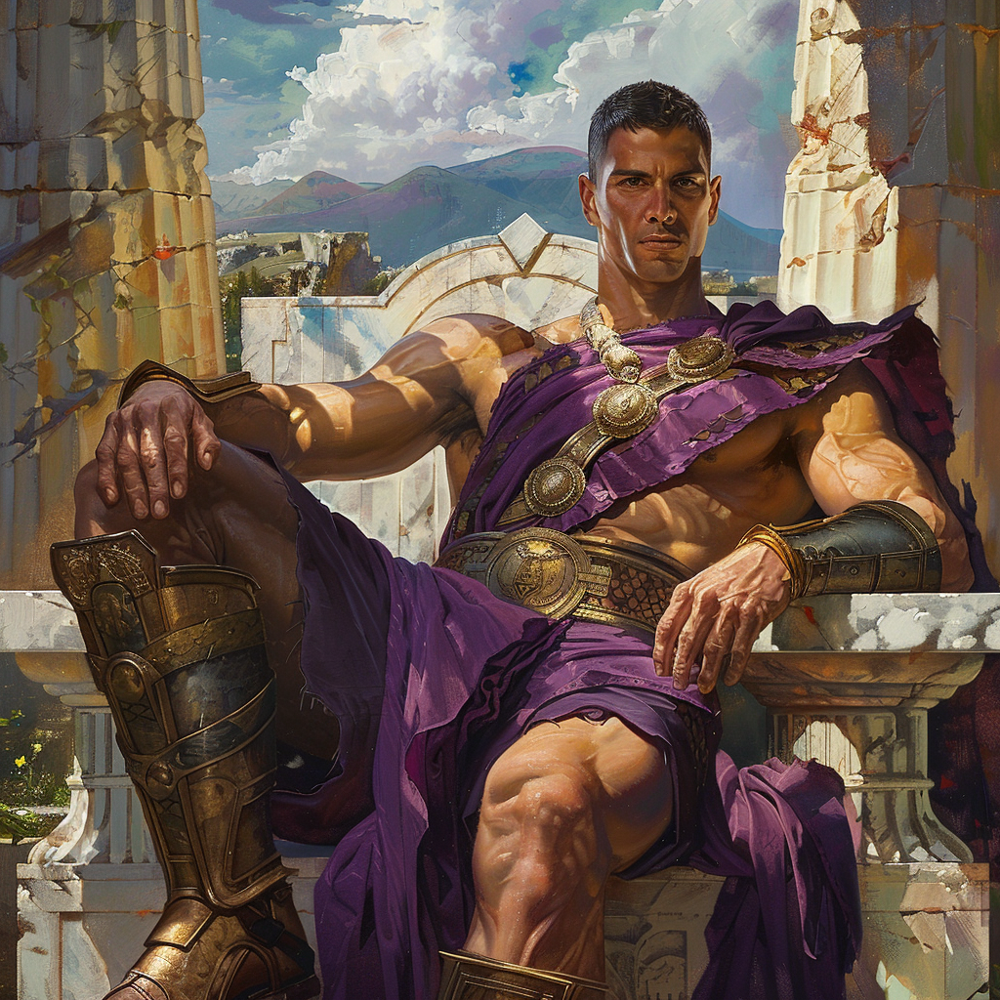

    

        ## Testament of the Divine
        
        Crafted in the visage of ultimate martial prowess, Alynne stands a colossus among the divine, his stature towering above
        the mortal coil, a testament to the supremacy of the celestial order. His flesh, wrought from the sacred metals of the
        heavens, gleams with the lustre of polished bronze, each muscle a testament to divine strength, each scar a chronicle of
        timeless battles fought in the name of order and harmony.
        
        Adorned in the royal purples of the cosmos, his garb flows like the rivers of creation, a symbol of nobility and the
        weight of his divine mandate. His countenance, chiseled from the very essence of valor, bears the serenity of the
        infinite, his gaze piercing the veil of time, his resolve unyielding.
    

    

        
    

Behold Alynne, the Paragon of Valor, whose divine essence is the bastion against the tempests of chaos. From the
celestial firmament of Aetherion Cradle, he watches, an unwavering sentinel, his form as resolute as the ancient
mountains, his spirit as boundless as the endless skies.

**The Marble Throne**

Upon his marble throne, set against the backdrop of creation's majesty, Champion Alynne presides. This throne, carved
from the heart of Aetherion's remnants, stands not only as his seat of power but as an altar of devotion, where the
faithful may lay their prayers and aspirations. It is here, in this sanctified nexus, that Alynne communes with the
essence of the divine, his voice a clarion call that resonates through the ether, guiding his followers toward their
ultimate destiny.

**The Divine Mandate**

Alynne's dominion, forged in the crucible of celestial warfare, is a realm where order prevails over chaos, where
strength is tempered with wisdom, and where the valorous find their sanctuary. He commands the legions of the heavens,
his strategies as intricate as the tapestry of fate, his might as formidable as the tide of creation.

**The Eternal Vigil**

Thus, in the sacred texts of Aetherion Cradle, the chronicle of Champion Alynne is inscribed, a saga of divine
stewardship and eternal vigilance. As the protector of the cosmic order, his legend permeates the annals of history, a
beacon for all who seek the path of righteousness amidst the shadows of uncertainty.

In reverence, we offer our prayers to Alynne, the Shield of Harmony, the Warden of War, that his strength might fortify
our spirits, and his wisdom illuminate our journey through the stars.
