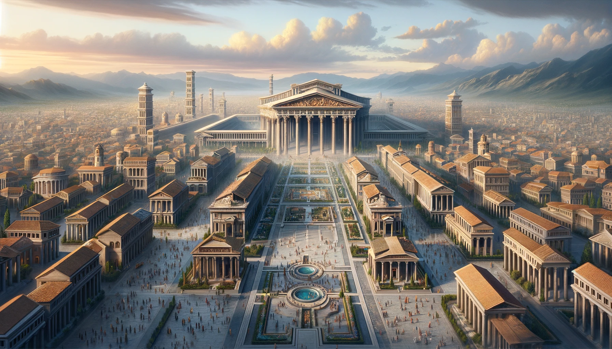

**Alynne: The Shield of Harmony**

Alynne, a jewel among the moons of Aetherion Cradle, mirrors the lush diversity of the ancient Earth. With half its vast
expanse covered in deep, sprawling oceans and the rest a tapestry of varied terrains and climates, it embodies a world
where nature's complexity is matched only by the society that thrives upon it.

**The Realm of Champion Alynne: A Testament to Order**

Champion Alynne, the guardian of this verdant sphere, presides over a domain where the art of governance is as refined
as that of war. From the grand temple that dominates the moon's capital, a marvel of architectural splendor and the
epicenter of the moon’s power, Alynne oversees a society that prizes order, discipline, and unity above all. This city,
the heart of Alynne's moon, pulses with the lifeblood of a civilization at the zenith of its cultural and military
might, reminiscent of the greatest empires of yore.

**The Capital: The Epicentre of Alynne's Might**

The capital city is a testament to the moon’s achievements in architecture, governance, and military organization. Its
streets are laid out with precision, leading to forums, public baths, and temples that stand as monuments to the
collective spirit and individual valor of its citizens. The Grand Temple, from where Champion Alynne rules, is not only
a place of worship but also a symbol of the unbreakable bond between the divine and the martial spirit that protects
this world.

The societal fabric of Alynne is intricately woven with the principles of stratocracy, where every citizen is a defender
of the realm, educated in the disciplines of war and peace. The moon’s legions, renowned for their discipline and
effectiveness, are as much a part of its identity as the philosophers, architects, and artists who contribute to its
cultural wealth.

**Alynne: A Reflection of Cosmic Balance**

In the cosmic tableau of Aetherion Cradle, Alynne shines as a beacon of balance between the martial and the serene, the
disciplined and the free-spirited. Its oceans and lands, its capital and its people, all resonate with the harmony of a
world where order does not stifle but rather elevates, crafting a society that is a paragon of cosmic civilization,
safeguarded by the vigilant and wise Champion Alynne.
