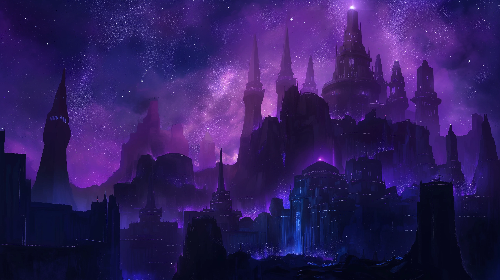

Thalirea, cloaked eternally in the shadow of the cracked world, is a realm where twilight reigns supreme. This perpetual
dusk has nurtured a unique civilization, predominantly inhabited by Drows and Deep Gnomes, beings traditionally forged
in darkness, thriving in the secrets that the shadow holds.

## A Society of Shadows

The Drows and Deep Gnomes of Thalirea have built a civilization that mirrors the complex beauty of their moon. Their
cities glow faintly with the bioluminescent light of fungi and crystal, casting gentle illumination on intricate stone
architecture that blends seamlessly with the natural caverns and rock formations. Society here values stealth, cunning,
and wisdom, with a deep reverence for the mysteries of the dark and the power it holds.

The inhabitants are a people of art and philosophy, exploring the depths of magic and science in ways that intertwine
with the essence of their world. Their crafts and technologies are adapted to their environment, utilizing the unique
resources that Thalirea offers, from glowing minerals to shadowy flora and fauna.

## Thalirea: A Realm Defined by Darkness

Thalirea stands as a bastion of introspection and discovery in the cosmos of Aetherion Cradle. Dominated by the Drows
and Deep Gnomes, its culture is a testament to the resilience and adaptability of life in constant twilight. The
Champion, in their Drow form, is not just a ruler but a symbol of the moon's enduring mystery and strength, guiding
their people with a silent, unseen hand.

In Thalirea, darkness is not an obstacle but a canvas, upon which the rich tapestry of its civilization is woven. It is
a world where the whisper of the shadow speaks louder than the roar of the light, and where the journey into the dark
reveals the luminescent soul of the universe.
