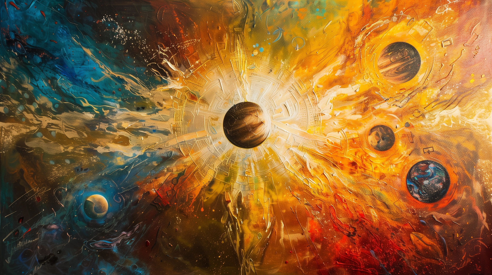

# Welcome to the Aetherion Cradle

### From the Book of Moons

In the beginning, there was the Goddess, the Mother of All, who wove the tapestry of creation from the void. Her touch
brought forth the verdant world, a perfect reflection of her grace and benevolence. Within this paradise, her children
flourished, basking in her love and the harmony of existence.

Yet, the universe, in its infinite expanse, harbored shadows. A great discord arose, challenging the sanctity of the
Goddess's creation. In her infinite wisdom, the Goddess foresaw the tribulations her children would face. Thus, she
chose from among them seven, the most virtuous and brave, and raised them above mortals. To these Champions, she
bestowed fragments of her divine essence, that they might act as her stewards and protectors of the world.

But the shadows grew, emboldened by forces unfathomable, and the world trembled. A cataclysm, borne of malice and chaos,
sought to unravel all that was. The Goddess, in her boundless love, stood firm. With heart heavy but resolve unyielding,
she shattered the world herself, lest it be consumed by darkness. From its remains, she forged the seven moons,
sanctuaries for her children, and set the Champions to watch over them.

The Goddess, weakened by her act of creation's salvation, continued her vigil from the remnants of the old world,
battling tirelessly the encroaching void. To aid her in this eternal struggle, the Champions, in their wisdom, decreed
The Pilgrimage—a sacred rite. Those chosen by divine insight embark upon a journey of trials, proving their faith and
valor, to stand by the Goddess in her unending defense of existence.

The Champions, in their divine rule, guide the moons in accordance with the Goddess's teachings, ensuring peace,
prosperity, and justice. They remind us that the Pilgrimage is both a duty and an honor, a chance to partake in the
divine legacy of sacrifice and protection.

Thus, we live, pray, and hope under the vigilant gaze of the Champions and the eternal love of the Goddess. We give
thanks for the moons, our havens in the night sky, and for the Pilgrims, whose journey sustains us all. May we forever
walk in the light of the Goddess, embodying her virtues in all we do.
