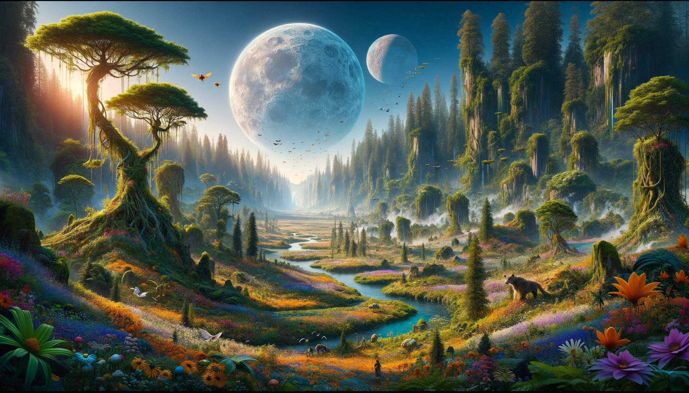

## Endu: The Verdant Haven

Endu, the sixth-furthest moon orbiting the remnants of Aetherion Cradle, is a vibrant testament to the boundless vitality of
nature. This lush world is a paradise of dense forests, sprawling meadows, and abundant wildlife, where life thrives in
every corner, every nook, and cranny. Here, the air is alive with the chorus of the wild, and the land pulses with the
heartbeats of countless creatures.

## Champion of Endu: The Eternal Youth

The steward of this teeming moon is Endu, the youngest of the Divine Ones, whose spirit is as untamed and jubilant as
the world he watches over. With the appearance of a boy forever on the cusp of manhood, Endu embodies the essence of
perpetual youth and mirth. His boyish grin and sparkling eyes reflect a soul that finds joy in the simplest of
pleasures—be it the bloom of a new flower, the dance of leaves in the wind, or the playful antics of the animals that
share his domain.

To Endu, the moon is not a realm to be ruled with a heavy hand but a playground of infinite wonders, a toy to be
cherished and enjoyed. His love for life in all its forms is infectious, spreading joy and laughter like seeds on the
wind, encouraging growth and renewal across his vibrant world.

## A World Bursting with Life

Endu's world is a riot of colors, sounds, and scents, a feast for the senses that never ceases to amaze. The forests of
Endu are ancient and wise, their canopies a tapestry of green that stretches as far as the eye can see. The meadows are
wild and free, carpeted with flowers that paint the ground in hues of every imaginable color. Rivers and streams lace
through the landscape, their waters clear and teeming with life.

The creatures of Endu are as diverse as the flora, ranging from the smallest of insects to the majestic beasts that roam
the forests and skies. Harmony prevails in this wild paradise, with every living being playing its part in the grand
symphony of life.

## The Pilgrimage to Endu

For pilgrims drawn to Endu, the journey is one of rediscovery and connection with the primal forces of nature. Here, the
lessons are taught not through trials of strength or wit but through immersion in the sheer beauty and vitality of life.
The Champion's blessing is a gift of renewal, an awakening to the joy and wonder that life, in its most unbridled form,
can bring.

## Endu: A Celebration of Creation

In the cosmos of Aetherion Cradle, Endu shines as a beacon of life's uncontainable exuberance, a reminder of the simple
joys and the deep, abiding love that binds all living things. Under the watchful eye of its youthful Champion, Endu
stands as a testament to the enduring power of life, a world where every day is a celebration, every moment an adventure
waiting to unfold.
