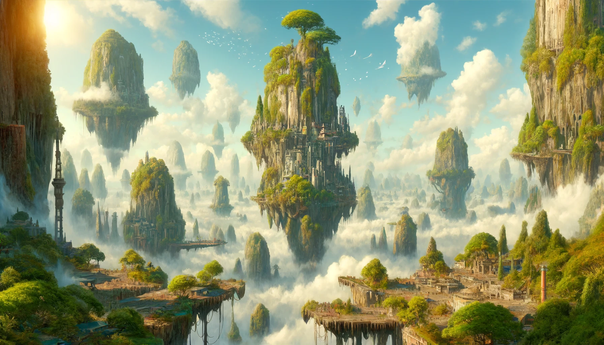

## Ilture: The Ethereal Aerie

In the grand cosmic dance of Aetherion Cradle, Ilture claims its place as the smallest of the moons, a delicate jewel
adrift in the celestial sea. Yet, what Ilture lacks in size, it compensates with a beauty and spirit unmatched by its
larger counterparts. This realm of the skies, where land and life itself float unbound, stands as a testament to the
aspirations and dreams of those who dwell within and beyond its borders.

## Civilization Amongst the Clouds

The civilizations of Ilture, though limited by the moon's modest size, are a marvel of adaptation and ingenuity. Built
into the sides of floating rock formations lush with greenery, these communities carve their existence from the air
itself. Homes and structures blend seamlessly with the natural landscape, connected by a network of bridges and tunnels
that make the sky not a barrier, but a thoroughfare for life and culture.

Travel and communication across Ilture are facilitated by ingenious airships and gliders, reflecting a people for whom
the sky is as much home as the solid rock beneath their feet. The architecture, with its integration of flora and open
spaces, ensures that the inhabitants live in constant communion with the air around them, their lives a perpetual dance
with the wind.

## The Pilgrimage to Ilture

The pilgrimage to Ilture is an ascendant journey, a test of one's ability to embrace the ephemeral and to find grounding
in the unanchored. Pilgrims learn the art of navigation not only across the physical distances between the floating
lands but through the metaphorical spaces between earth and sky, solidity and freedom. The Champion's blessing is
bestowed upon those who can show true adaptability, who can soar without losing sight of the ground below, and who
understand the profound truths hidden in the whispering breezes.

## Ilture: A Symphony of Freedom

In the broader narrative of Aetherion Cradle, Ilture shines as a beacon of liberty and perspective, a realm where the
horizon beckons not as the end of the world, but as the beginning of understanding. Champion Ilture, with his deep love
for the skies, invites all under his watch to seek the heights, to live with hearts unbound, and to embrace the
limitless potential that life among the clouds offers. Ilture, the smallest of moons, proves that in the vastness of the
cosmos, the spirit's expanse, not the physical dimension, defines the true scale of existence.
