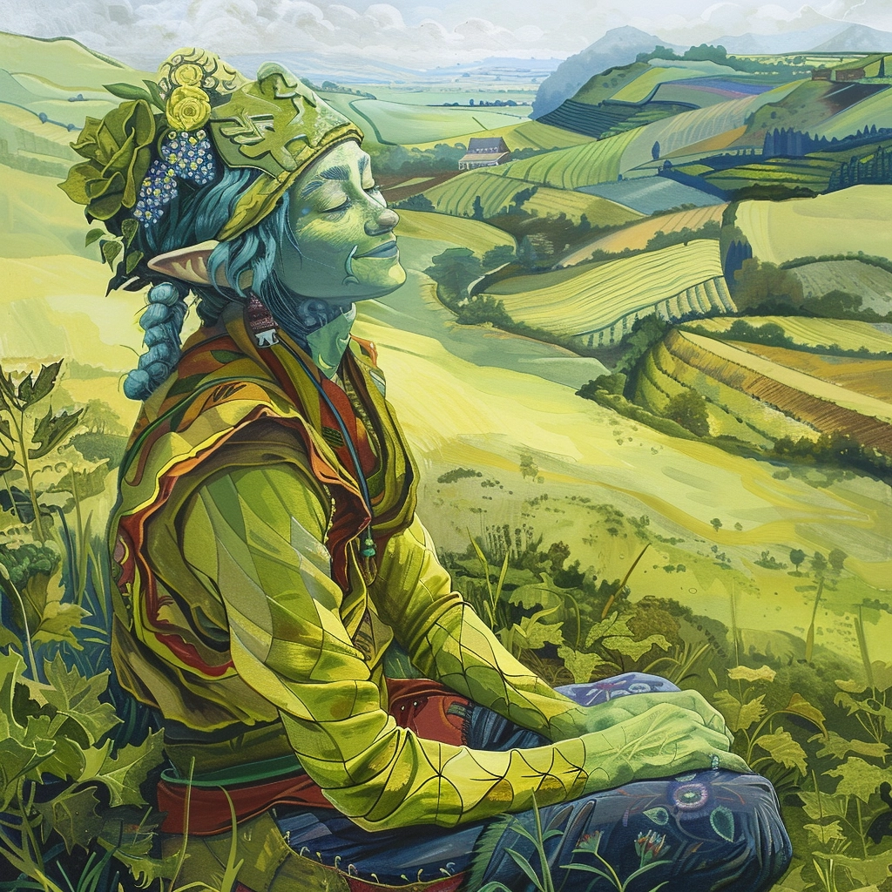

    

        The protector of Ninsune is a figure of gentle strength and boundless nurturance, embodying the androgynous beauty that
        transcends the binary, a true reflection of the moon's inhabitants themselves. This Champion, whose domain encompasses
        the cycles of life and the sanctity of the soil, watches over Ninsune with a soft but omnipresent gaze. Their form is
        the embodiment of life's fertility and resilience, a symbol of the unity between the land and its people, guiding them
        in the arts of cultivation, harmony, and sustainable existence.
    

    

        
    

## Guardian of Growth

In a world without need for grandiose titles or distinctions, the Champion is known simply as The Guardian of Growth, a
testament to their role in fostering the abundant life that flourishes across Ninsune. They are celebrated not only for
their divine stewardship but for their embodiment of the moon's values: equality, community, and a deep, reverent
connection to the land.

