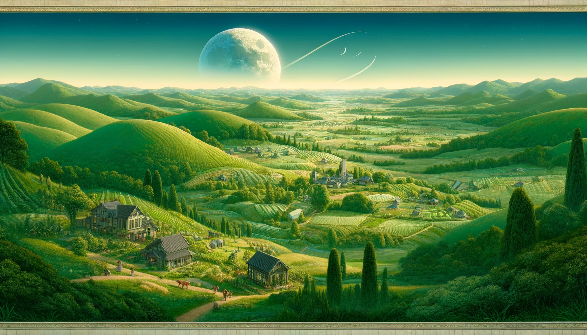

## Ninsune: The Pastoral Moon

Ninsune, a celestial haven within the embrace of Aetherion Cradle, presents a vision of idyllic tranquility and verdant
bounty. It is a world where the undulating hills roll into the horizon, covered in a quilt of greenery and wildflowers,
and where the rhythms of life and farming dictate the passage of time. This Earth-like moon celebrates the simple, good
life, eschewing the clamor of large cities for the harmony of villages, each a beacon of community and kinship.

## Life on Ninsune: A Tapestry of Harmony

On Ninsune, life thrives in the embrace of tightly-knit communities. Villages dot the landscape like jewels, each a
microcosm of cooperation and shared purpose. Homes are nestled within the folds of the land, constructed with materials
that whisper of the earth's generosity. Agriculture is not merely a means of sustenance but a celebration of life
itself, with fields and gardens meticulously tended to honor the land that sustains them.

The people of Ninsune live by the cycles of the sun and moon, their days marked by the labor of love that is farming,
and their nights by the communal festivities that weave the fabric of their society. Each parish and community is a
constellation of shared lives and stories, where every individual, regardless of their role, contributes to the
collective well-being.

## The Pilgrimage of the Earth-Tenders

Pilgrims to Ninsune are drawn by the promise of reconnecting with the elemental forces of life. Their journey is one of
rekindling the primal bond between the soil and the soul, learning the ancient wisdom that guides the sowing and
reaping, the tending and harvesting. The Guardian of Growth offers blessings of abundance and fertility, not just of the
land, but of the spirit, teaching that true wealth lies in health, happiness, and the unity of community.

## Ninsune: A Reflection of Serenity

In the cosmic array of Aetherion Cradle's moons, Ninsune emerges as a bastion of peace, a reminder of the profound
beauty found in simplicity and the sustenance of the soul. Guided by their androgynous Champion, the people of Ninsune
embody the ideals of equality, sustainability, and the joy found in the rhythms of nature.

Ninsune stands as a testament to the idea that in life's simplicity lies its greatest richness, offering a vision of a
world where the land and its people exist in perfect harmony, their hearts and hopes intertwined with the cycle of
seasons and the bounty of the earth.
