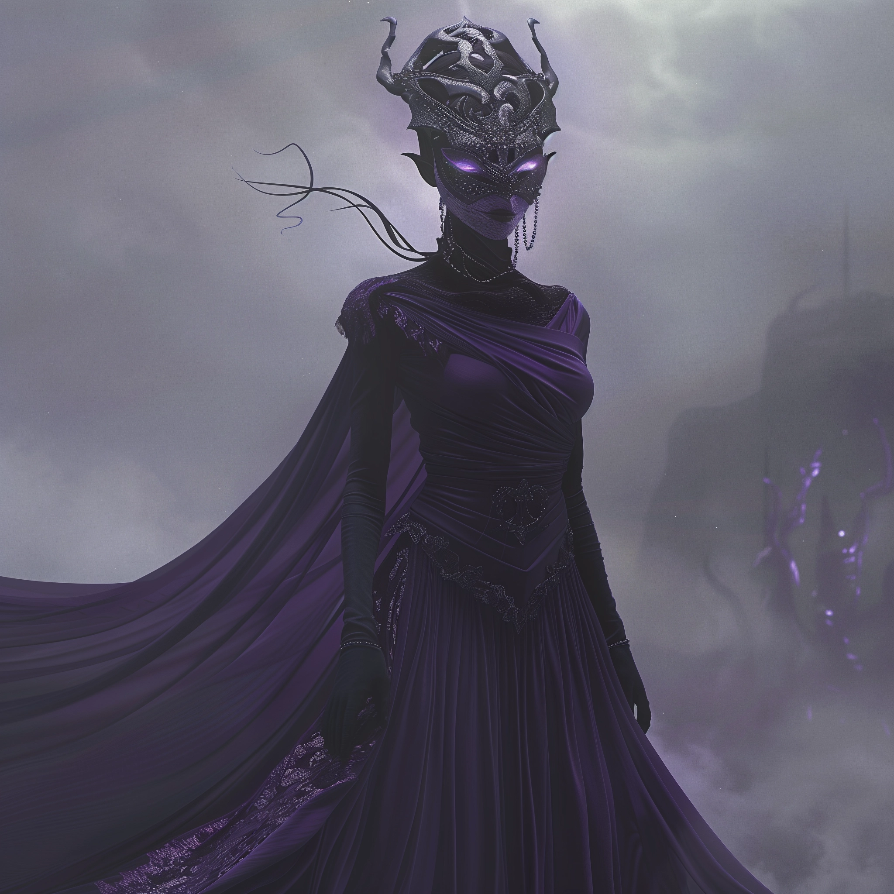

    

        The protector of Thalirea, embodying the enigmatic and mystical nature of this moon, has chosen the form of a
        Drow—slender, tall, and perpetually masked. This visage, always hidden behind a mask that whispers of both mystery and
        majesty, serves as a symbol of the Champion's role as the guardian of secrets and the master of the unseen. In this
        form, the Champion moves like a shadow amongst shadows, a silent guide and protector for the denizens of Thalirea.
    

    

        
    

